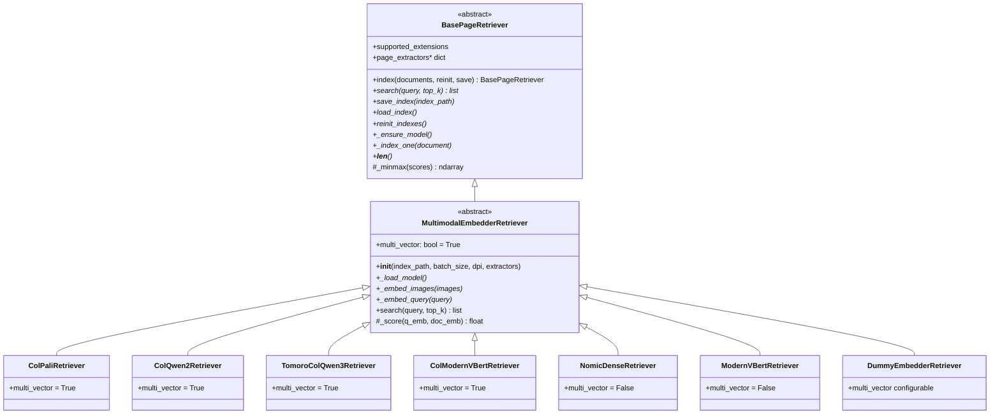
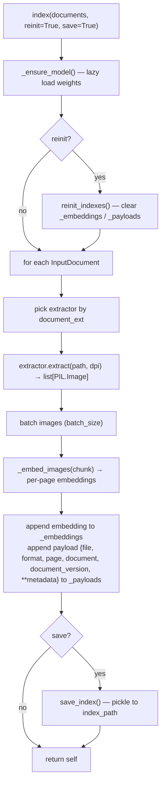
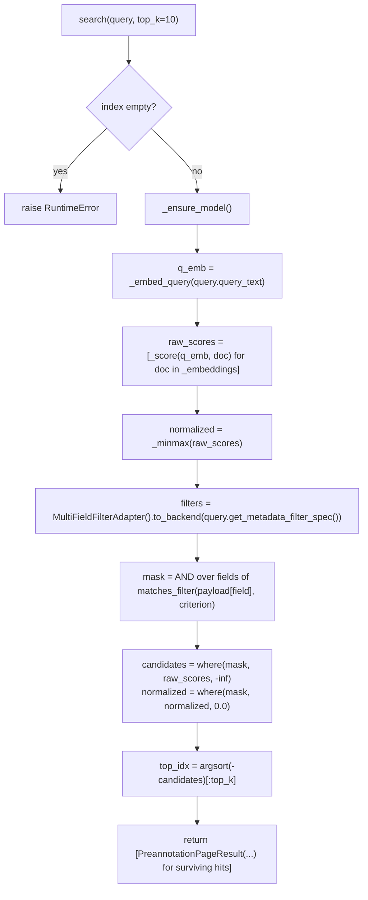

# Architecture

`example_needle` is split into two packages with a strict dependency direction:
`needle` depends on `needle_core`, never the other way round.

## Two-package design

### `needle_core` — the domain layer

A dependency-light domain that models documents, queries and metadata filters.
It deliberately avoids torch, transformers, ORMs and pydantic so it can be
imported anywhere (CLIs, services, tests) without a heavy ML stack.

| Module | Key types |
| --- | --- |
| `needle_core.domain.types` | `DocumentExtension` |
| `needle_core.domain.document.document` | `Document`, `DocumentVersion`, `DocumentPage` |
| `needle_core.domain.interaction.query` | `Query` |
| `needle_core.domain.metadata.filter_spec` | `FilterOperator`, `FieldFilter`, `MetadataFilterSpec` |
| `needle_core.domain.metadata.backend_filter_adapters` | `BackendFilterAdapter`, `MultiFieldFilterAdapter`, `OPERATOR_TO_BACKEND` |

* A **`Document`** is the logical entity ("the Q3 earnings report"), identified by
  a `document_id` and a `document_ext` (a `DocumentExtension`).
* A **`DocumentVersion`** is a concrete on-disk materialisation: a
  `document_path` plus a `document_metadata` dict.
* A **`DocumentPage`** is a single, 1-indexed page within a version.
* A **`Query`** carries `query_text` plus a `MetadataFilterSpec`.

### `needle` — the retrieval layer

The retrieval layer depends on torch and (for real models) `colpali-engine`. It
owns:

| Module | Responsibility |
| --- | --- |
| `needle.retrieval.extractors` | Rasterise files into per-page `PIL.Image` lists. |
| `needle.retrieval.page_retrievers` | The retriever hierarchy (embed + index + search). |
| `needle.retrieval.page_retriever_utils` | `matches_filter` and `SimilarityMapVisualizer`. |
| `needle.retrieval.registry` | Name → retriever-class factory (`get_retriever`). |
| `needle.retrieval.data` | I/O carriers: `InputDocument`, `PreannotationPageResult`, … |
| `needle.testing` | `DummyEmbedderRetriever` — a weight-free retriever for tests/demos. |

## The retriever hierarchy

* **`BasePageRetriever`** is a pure abstract base. It defines the public contract
  (`index`, `search`, `save_index`, `load_index`, `reinit_indexes`, `__len__`)
  and provides two shared concretions: the `index()` loop and the static
  `_minmax` normaliser. Everything else is abstract.
* **`MultimodalEmbedderRetriever`** implements an in-memory index (two parallel
  lists, `_embeddings` and `_payloads`, pickled to disk) and the full
  `search()` algorithm. It reduces the per-model surface to **three abstract
  hooks** — `_load_model`, `_embed_images`, `_embed_query` — plus the
  `multi_vector` class flag.
* **Concrete retrievers** only implement those three hooks and set
  `multi_vector`. See [Retrievers](retrievers.md).

## Lazy torch imports

torch is heavy, so the packages go out of their way to avoid importing it until a
retriever is genuinely needed:

* `import needle` and `import needle.retrieval` import only the torch-free
  building blocks (data carriers, extractors, filter helpers). The retriever
  classes are exposed via [PEP 562](https://peps.python.org/pep-0562/) module
  `__getattr__`, so `needle.ColQwen2Retriever` only triggers the torch import the
  first time it is accessed.
* Inside each concrete retriever, the `colpali-engine` model/processor classes
  are imported **inside `_load_model`**, not at module top level. So even after
  the class is imported, the model backend is only pulled in when you instantiate
  and use the retriever.
* `_ensure_model()` defers the actual weight load until the first `index()` or
  `search()` call (it sets `self._loaded = True` so the load happens once).

The net effect: the domain layer and extractor utilities stay importable in a
minimal environment, and you only pay for torch + a model when you actually
retrieve.

## The `index()` pipeline

`index()` lives on `BasePageRetriever`; the per-document work lives in
`MultimodalEmbedderRetriever._index_one`.

Each payload stores the originating `document` and `document_version` plus the
flattened `document_metadata`, which is what makes metadata filtering possible at
search time.

## The `search()` pipeline

`search()` lives on `MultimodalEmbedderRetriever`.

* `_score` dispatches on `multi_vector`: MaxSim for multi-vector models, cosine
  similarity for dense models (see [Retrievers](retrievers.md)).
* The metadata filter is applied **after** scoring, as a boolean mask — filtered-out
  pages get a `-inf` raw score (so they never reach the top-*k*) and a `0.0`
  normalised score. See [Filters](filters.md).
* Results come back as `PreannotationPageResult` dataclasses; call
  `.to_annotation_result()` to adapt them to the `(version, page, annotation)`
  triple consumed by `retriever.show(...)`.
