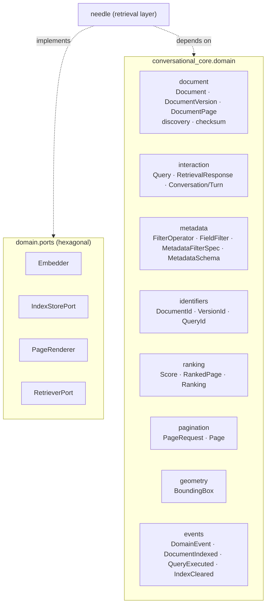

# Domain model

`conversational_core.domain` is the **dependency-light domain layer**. It models
documents, queries, rankings and the surrounding value objects as plain
dataclasses — no torch, transformers, ORMs or pydantic — so it can be imported
anywhere, including environments without an ML stack. The retrieval layer
(`needle`) depends on this package, never the other way round.



## Documents

A `Document` is the **logical** entity ("the Q3 earnings report"); a
`DocumentVersion` is a concrete on-disk materialisation of it; a `DocumentPage` is
a single page within a version. They live in
`conversational_core.domain.document.document`.

```python
from conversational_core.domain.document.document import (
    Document, DocumentVersion, DocumentPage,
)

doc = Document.from_path("report.pdf", title="Q3 report")
# document_ext is a DocumentExtension; document_id defaults to "doc_<hex12>"

version = DocumentVersion(
    document_path="report.pdf",
    document_metadata={"year": 2023, "region": "EU"},
)
version = version.with_metadata(language="en")   # returns a copy with metadata merged

page = DocumentPage(page_number=1)   # page_number is 1-indexed; < 1 raises ValueError
```

`DocumentVersion` exposes `path` and `filename` properties; `Document.from_path`
infers the extension and defaults the title to the file stem.

## Discovery and checksums

`conversational_core.domain.document.discovery` walks a directory tree and turns
recognised files into `(Document, DocumentVersion)` pairs ready for indexing. A
file is kept when its extension resolves to a known `DocumentExtension` (or appears
in an explicit `suffixes` allow-list).

```python
from conversational_core.domain.document.discovery import (
    discover_documents, count_by_extension,
)

pairs = discover_documents("./corpus", suffixes=["pdf", "png"], with_checksum=True)
counts = count_by_extension("./corpus")   # {"pdf": 12, "png": 3}
```

`conversational_core.domain.document.checksum` provides streamed SHA-256 helpers
(used by discovery when `with_checksum=True`):

```python
from conversational_core.domain.document.checksum import (
    sha256_bytes, sha256_file, short_checksum,
)

short_checksum("report.pdf")          # first 12 hex chars of the digest
sha256_file("report.pdf")             # full hex digest (streamed in chunks)
```

## Queries and metadata filters

A `Query` carries the natural-language `query_text` plus an optional
`MetadataFilterSpec`. Retrievers read `query_text` for embedding and call
`get_metadata_filter_spec()` to obtain the structured filter.

```python
from conversational_core.domain.interaction.query import Query
from conversational_core.domain.metadata.filter_spec import FilterOperator

# Convenience constructor: scalars → EQ, list/tuple/set → IN.
query = Query.of("operating margin", top_k=5, filters={"year": [2022, 2023]})

# Chainable, explicit operators (returns a new Query each time).
query = query.with_filter("language", "en").with_filter("year", 2020, FilterOperator.GTE)
```

A `MetadataFilterSpec` is an **ordered conjunction (AND)** of frozen `FieldFilter`
`(field, operator, value)` triples, and `FilterOperator` is the supported set of
comparisons (`EQ`, `NE`, `IN`, `NIN`, `GT`, `GTE`, `LT`, `LTE`, `CONTAINS`,
`EXISTS`, `REGEX`). See [Filters](filters.md) for the full filter contract.

### Metadata schema validation

`conversational_core.domain.metadata.schema` declaratively validates a metadata
dict against a list of `MetadataField` declarations, returning human-readable
errors:

```python
from conversational_core.domain.metadata.schema import MetadataField, MetadataSchema

schema = MetadataSchema([
    MetadataField("year", type=int, required=True),
    MetadataField("region", type=str, choices=("EU", "US")),
])

schema.validate({"year": 2023, "region": "EU"})   # []  (valid)
schema.is_valid({"region": "APAC"})                # False (missing year; bad choice)
```

Note that `bool` is rejected where an `int` is expected (Python treats `bool` as an
`int` subclass; the schema corrects for that surprise).

## Identifiers

`conversational_core.domain.identifiers` provides typed, self-describing
identifier wrappers around `str`. Each stringifies to its raw value and has a
`.new()` factory that generates a prefixed, uuid-based id.

```python
from conversational_core.domain.identifiers import DocumentId, VersionId, QueryId

DocumentId.new()   # DocumentId(value="doc_1a2b3c4d5e6f")
VersionId.new()    # VersionId(value="ver_...")
QueryId.new()      # QueryId(value="q_...")
```

## Ranking

`conversational_core.domain.ranking` models scores and ranked results. A `Score`
pairs a raw retriever score with an optional normalised value in `[0, 1]`; a
`RankedPage` ties a score to a page (and optional provenance); a `Ranking` is an
ordered list of ranked pages, best first.

```python
from conversational_core.domain.ranking import Score, RankedPage, Ranking

ranking = Ranking.from_scores(pages=[1, 2, 3], raw_scores=[0.2, 0.9, 0.5])
# min-max normalises into [0, 1] and sorts by raw score descending
ranking.best          # RankedPage for page 2 (highest score)
ranking.top_k(2)      # a new Ranking with the 2 best pages

score = Score(raw=0.9, normalized=1.0)
score.value           # normalised value if present, else raw
```

## Pagination

`conversational_core.domain.pagination` provides offset/limit pagination. A
`PageRequest` captures the requested slice; a `Page` wraps the resulting items plus
the total count and computes navigation state.

```python
from conversational_core.domain.pagination import PageRequest, Page

request = PageRequest(offset=20, limit=10)   # offset >= 0, limit >= 1 (else ValueError)
page = Page(items=results, total=57, request=request)
page.has_next      # True
page.has_prev      # True
page.num_pages     # 6
page.page_number   # 3 (1-indexed)
```

## Geometry

`conversational_core.domain.geometry` defines `BoundingBox`, an axis-aligned
rectangle with `x0 <= x1` and `y0 <= y1` (validated in `__post_init__`). It
supports intersection, intersection-over-union and normalisation to `[0, 1]`.

```python
from conversational_core.domain.geometry import BoundingBox

a = BoundingBox(0, 0, 10, 10)
b = BoundingBox(5, 5, 15, 15)

a.area                 # 100.0
a.intersection(b)      # BoundingBox(5, 5, 10, 10)  (or None when disjoint)
a.iou(b)               # intersection-over-union, 0.0 when disjoint
a.normalized(100, 50)  # coordinates divided by width/height
```

## Events

`conversational_core.domain.events` provides lightweight records describing things
that happened in the domain. Each carries an ISO-8601 `occurred_at` timestamp and
exposes a stable `event_type` string (the class name) for routing/serialisation.

```python
from conversational_core.domain.events import (
    DomainEvent, DocumentIndexed, QueryExecuted, IndexCleared,
)

evt = QueryExecuted(query_text="revenue", num_results=5, took_ms=12.3)
evt.event_type     # "QueryExecuted"
evt.occurred_at    # ISO-8601 UTC timestamp
```

## Responses and conversations

`conversational_core.domain.interaction.response.RetrievalResponse` bundles the
`Query` that was executed with its ranked results and the wall-clock time the
retrieval took:

```python
from conversational_core.domain.interaction.response import RetrievalResponse

response = RetrievalResponse(query=query, results=hits, took_ms=12.3)
response.best        # top result, or None
response.is_empty    # whether there are no results
```

`conversational_core.domain.interaction.conversation` models multi-turn dialogue.
A `Turn` pairs a user `Query` with an optional response; a `Conversation` is an
ordered sequence of turns:

```python
from conversational_core.domain.interaction.conversation import Conversation

convo = Conversation()
convo.add_turn(query)
convo.last                 # most recent Turn, or None
convo.history_text()       # query texts joined by newlines
```

## Hexagonal ports

`conversational_core.domain.ports` declares the abstractions the retrieval layer
implements, keeping the domain independent of any concrete backend. Three are
structural `Protocol`s (`@runtime_checkable`) and one is an ABC:

| Port | Kind | Implemented by | Key methods |
| --- | --- | --- | --- |
| `Embedder` | `Protocol` | `needle.embedders.BaseEmbedder` and subclasses | `embed_images`, `embed_query`, `multi_vector` |
| `IndexStorePort` | ABC | `needle.indexing.BaseIndexStore` adapters | `add`, `embeddings`, `payloads`, `clear`, `save`, `load`, `__len__` |
| `PageRenderer` | `Protocol` | `needle.retrieval.extractors.PageToImageExtractor` | `extract(path, *, dpi=150, **kwargs)` |
| `RetrieverPort` | `Protocol` | `needle.retrieval.page_retrievers.BasePageRetriever`, `RetrievalPipeline` | `index`, `search`, `__len__` |

```python
from conversational_core.domain.ports.embedder import Embedder
from conversational_core.domain.ports.index_store import IndexStorePort
from conversational_core.domain.ports.page_renderer import PageRenderer
from conversational_core.domain.ports.retriever import RetrieverPort
```

The application services (`needle.application`) depend on `RetrieverPort` rather
than any concrete retriever, so they work equally with a model-backed retriever or
a torch-free [`RetrievalPipeline`](pipeline.md). For the `Embedder` and
`IndexStorePort` implementations see [Pipeline](pipeline.md) and
[Indexing](indexing.md); for `PageRenderer` see [Extractors](extractors.md).
