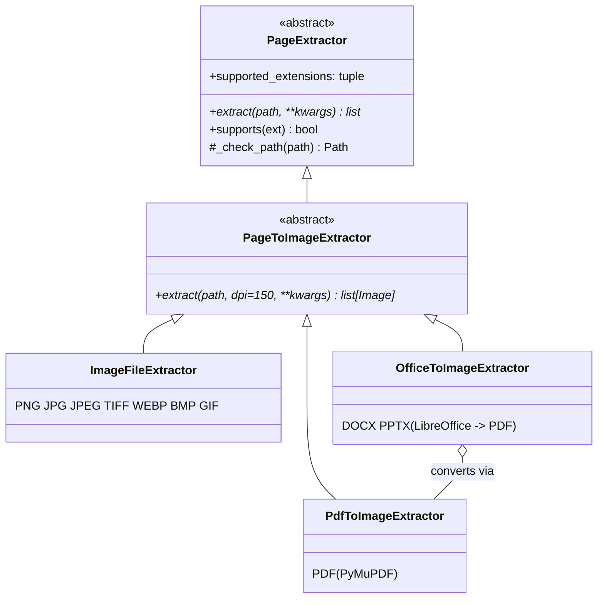

# Extractors

The retrievers in `example_needle` are **visual**: they embed page *images*. An
**extractor** is the component that turns a file on disk into a list of
`PIL.Image.Image` objects, one per page. They live in
`needle.retrieval.extractors`.

## The extractor hierarchy



* **`PageExtractor`** — abstract base. Declares `supported_extensions`, the
  abstract `extract(path, **kwargs)`, a `supports(ext)` predicate, and a
  `_check_path` helper that raises `FileNotFoundError` for missing files.
* **`PageToImageExtractor`** — abstract subclass whose `extract` rasterises to one
  RGB `PIL.Image` per page and takes a `dpi` keyword.
* **`ImageFileExtractor`** — single-image formats; the file *is* the one page.
  Multi-frame images (animated GIF, multipage TIFF) yield one page per frame.
* **`PdfToImageExtractor`** — renders PDF pages via PyMuPDF.
* **`OfficeToImageExtractor`** — converts DOCX/PPTX to PDF first (via LibreOffice),
  then delegates to a `PdfToImageExtractor`.

## Extension → extractor mapping

The default mapping is `IMAGE_EXTRACTORS`, a
`dict[DocumentExtension, PageToImageExtractor]`. A retriever stores it as
`self.extractors` and exposes it as the `page_extractors` property; the set of keys
is what `supported_extensions` reports.

| Extension(s) | Extractor |
| --- | --- |
| `PDF` | `PdfToImageExtractor` |
| `DOCX`, `PPTX` | `OfficeToImageExtractor` |
| `PNG`, `JPG`, `JPEG`, `TIFF`, `WEBP`, `BMP`, `GIF` | `ImageFileExtractor` |

Look an extractor up directly with `get_extractor`, which raises
`UnsupportedExtensionError` for unmapped formats:

```python
from needle.retrieval.extractors import get_extractor, IMAGE_EXTRACTORS

ext_handler = get_extractor("pdf")                 # accepts a str or DocumentExtension
pages = ext_handler.extract("report.pdf", dpi=200) # list[PIL.Image]

# Pass a custom table as the second argument to override the default lookup.
ext_handler = get_extractor("png", IMAGE_EXTRACTORS)
```

## The `dpi` parameter

`dpi` controls rasterisation resolution and applies to every
`PageToImageExtractor.extract(..., dpi=150)` call. Inside `PdfToImageExtractor` it
becomes a PyMuPDF zoom factor (`zoom = dpi / 72.0`), so higher DPI yields larger,
sharper page images. Retrievers pass their constructor `dpi` (default `150`) down
to the extractor in `_index_one`. Higher DPI improves legibility of small text and
figures but increases memory and embedding time; `150` is a sensible default,
`200`–`300` for dense scanned documents.

```python
from needle.retrieval.page_retrievers import ColQwen2Retriever

retriever = ColQwen2Retriever(dpi=200)  # rasterise every page at 200 DPI
```

## Optional dependencies

Extractors import their heavy backends lazily, so simply importing the module is
cheap and the dependencies are only required for the formats that need them.

* **PDF** — needs **PyMuPDF** (`fitz`). Install via the `[pdf]` extra:
  `pip install example-needle[pdf]` (or `pip install pymupdf`). Without it,
  rendering a PDF raises `UnsupportedExtensionError` with install guidance.
* **Office (DOCX/PPTX)** — needs **LibreOffice** (`soffice` or `libreoffice`) on
  `PATH`; the extractor shells out to it to convert to PDF, then rasterises the
  result (so PyMuPDF is needed too). If neither binary is found, a clear
  `UnsupportedExtensionError` is raised — convert to PDF first or install
  LibreOffice.
* **Images** — only **Pillow**, which is a core dependency; no extras needed.

## Resolving extensions: `DocumentExtension`

`needle_core.domain.types.DocumentExtension` is a `str`-backed enum, so its
members compare equal to their string value and work as dict keys (which is exactly
how `IMAGE_EXTRACTORS` is keyed). Two constructors normalise inputs:

```python
from needle_core.domain.types import DocumentExtension

DocumentExtension.from_string("PDF")     # DocumentExtension.PDF
DocumentExtension.from_string(".pdf")    # leading dot stripped
DocumentExtension.from_string("tif")     # alias → DocumentExtension.TIFF
DocumentExtension.from_string("htm")     # alias → DocumentExtension.HTML

DocumentExtension.from_path("/data/report.pdf")   # DocumentExtension.PDF
DocumentExtension.from_path("slides.PPTX")         # DocumentExtension.PPTX
```

* `from_string` lowercases, strips a leading `.`, and resolves aliases
  (`tif`→`tiff`, `htm`→`html`, `markdown`/`mdown`→`md`, `text`→`txt`). Unknown
  values raise `ValueError`.
* `from_path` infers the extension from a path's suffix (and raises `ValueError`
  if the path has none).
* Convenience predicates: `.is_image` (raster formats) and `.is_renderable`
  (image formats plus PDF/DOCX/PPTX — i.e. everything an extractor can turn into
  page images).

## Registering a custom extractor

A retriever accepts an `extractors=` dict in its constructor. To support a new
format — or override how an existing one is handled — build a custom mapping and
pass it in. The keys must be `DocumentExtension` members (the same type
`IMAGE_EXTRACTORS` uses).

```python
from pathlib import Path

from needle.retrieval.extractors import IMAGE_EXTRACTORS, PageToImageExtractor
from needle.retrieval.page_retrievers import ColQwen2Retriever
from needle_core.domain.types import DocumentExtension


class XlsxToImageExtractor(PageToImageExtractor):
    """Example: render spreadsheets to page images however you like."""

    supported_extensions = (DocumentExtension.XLSX,)

    def extract(self, path, *, dpi: int = 150, **kwargs):
        path = self._check_path(path)
        ...  # produce and return a list[PIL.Image.Image]
        return []


# Extend the default table rather than replacing it.
custom = {**IMAGE_EXTRACTORS, DocumentExtension.XLSX: XlsxToImageExtractor()}

retriever = ColQwen2Retriever(extractors=custom)
print(retriever.supported_extensions)  # now includes DocumentExtension.XLSX
```

Because `supported_extensions` and `page_extractors` are derived from this dict,
the retriever automatically advertises and indexes the new format.
