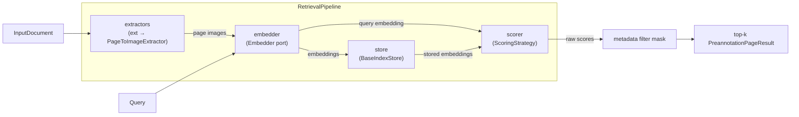

# Pipeline

`needle.pipeline.RetrievalPipeline` is a **composable, torch-free** retriever. It
implements the same `index()` / `search()` flow as the concrete retrievers (see
[Architecture](architecture.md)), but instead of baking the model, store and
scorer into a class hierarchy it wires them together from independent parts you
choose:

```
embedder  →  index store  →  scorer  →  extractors
```

Paired with the weight-free
[`DeterministicEmbedder`](#the-deterministic-embedder) it runs end to end with
**no model weights, no network and no GPU** — which is exactly how the examples
and tests exercise it. Swap in a real `Embedder` and it becomes a model-backed
retriever with no other code changes.

## Component wiring



* `embedder` — any [`Embedder`](domain-model.md#hexagonal-ports) implementation
  (`embed_images`, `embed_query`, `multi_vector`).
* `store` — any [`BaseIndexStore`](indexing.md) (defaults to `InMemoryIndexStore`).
* `scorer` — a [`ScoringStrategy`](#choosing-a-scorer); when omitted it is chosen
  from `embedder.multi_vector` via `get_scorer`.
* `extractors` — the extension → extractor map (defaults to `IMAGE_EXTRACTORS`,
  see [Extractors](extractors.md)).

## Building a pipeline

The easiest entry point is `needle.factory.build_pipeline`, which defaults to the
weight-free `DeterministicEmbedder`:

```python
from needle.factory import build_pipeline

pipeline = build_pipeline()   # DeterministicEmbedder + InMemoryIndexStore + MaxSim
```

`build_pipeline(embedder=None, **kwargs)` forwards every keyword argument to
`RetrievalPipeline`, so you can override the store, scorer, extractors, `dpi` and
`batch_size` in the same call:

```python
from needle.factory import build_pipeline
from needle.indexing import PickleIndexStore

pipeline = build_pipeline(store=PickleIndexStore(), dpi=200, batch_size=8)
```

You can also construct it directly:

```python
from needle.embedders import DeterministicEmbedder
from needle.pipeline import RetrievalPipeline

pipeline = RetrievalPipeline(DeterministicEmbedder())
```

The full constructor is:

```python
RetrievalPipeline(
    embedder,                 # Embedder (required, positional)
    *,
    store=None,               # BaseIndexStore; defaults to InMemoryIndexStore()
    scorer=None,              # ScoringStrategy; defaults to get_scorer(embedder.multi_vector)
    extractors=None,          # dict[DocumentExtension, PageToImageExtractor]; defaults to IMAGE_EXTRACTORS
    dpi=150,                  # DEFAULT_DPI
    batch_size=4,             # DEFAULT_BATCH_SIZE
)
```

## The deterministic embedder

`needle.embedders.DeterministicEmbedder` derives embeddings from a SHA-256 hash of
the input bytes, so the same image or query always maps to the same vector — no
model, no network, no GPU. It satisfies the same `Embedder` port as the real
backends.

```python
from needle.embedders import DeterministicEmbedder

# Multi-vector (MaxSim) by default; set multi_vector=False for dense/cosine.
embedder = DeterministicEmbedder(dim=32, num_tokens=8, multi_vector=True)
print(embedder.regime)   # 'multi-vector (MaxSim)'
```

`dim` and `num_tokens` must be `>= 1`. Real model loaders live in
[`needle.embedders.colpali_engine`](configuration.md#real-model-backends) and are
imported lazily.

## Indexing

`index(documents, reinit=True)` extracts each document into page images, embeds
them in batches, and adds one `(embedding, payload)` pair per page to the store.
It returns the pipeline (so calls can chain) and, when `reinit=True`, clears the
store first.

```python
from needle.factory import build_pipeline
from needle.retrieval.data import InputDocument

pipeline = build_pipeline()
pipeline.index([
    InputDocument.from_path("a.png", metadata={"year": 2023, "region": "EU"}),
    InputDocument.from_path("b.png", metadata={"year": 2018, "region": "US"}),
])
print(len(pipeline))   # number of indexed pages
```

Each payload carries `file`, `format`, `page`, the originating `document` and
`document_version`, and the flattened `document_metadata` — which is what makes
metadata filtering possible at search time. Unreadable documents are skipped with
a warning, mirroring the concrete retrievers.

## Searching with a metadata filter

`search(query, top_k=10)` embeds the query, scores it against every stored
embedding, min-max normalises the scores, applies the query's metadata filter as a
boolean mask, and returns the surviving top-*k* pages as
`PreannotationPageResult` objects. Searching an empty index raises
`needle_core.domain.exceptions.EmptyIndexError`.

```python
from needle_core.domain.interaction.query import Query
from needle_core.domain.metadata.filter_spec import FilterOperator

query = (
    Query.of("revenue breakdown")
    .with_filter("year", 2020, FilterOperator.GTE)
    .with_filter("region", ["EU", "US"], "in")
)

for hit in pipeline.search(query, top_k=5):
    print(round(hit.score, 3), hit.document_version.filename, "page", hit.page)
```

Filtering uses the same machinery as the retrievers: the spec is translated by
`MultiFieldFilterAdapter().to_backend(...)` and matched per page with
`matches_filter`. Filtered-out pages get a `-inf` raw score (so they never reach
the top-*k*) and a `0.0` normalised score. See [Filters](filters.md) for the full
filter contract.

## Swapping the store

The store is just a `BaseIndexStore`, so persistence is a one-line change. To keep
an index on disk in the same `{"embeddings", "payloads"}` layout the retrievers
use, build the pipeline with a `PickleIndexStore`:

```python
from needle.factory import build_pipeline
from needle.indexing import PickleIndexStore

store = PickleIndexStore()
pipeline = build_pipeline(store=store)
pipeline.index([InputDocument.from_path("a.png")])

store.save("index.pkl")          # persist
PickleIndexStore().load("index.pkl")   # reload elsewhere
```

See [Indexing](indexing.md) for the trade-offs between `InMemoryIndexStore`,
`PickleIndexStore` and `NumpyIndexStore`.

## Choosing a scorer

By default the scorer is selected from `embedder.multi_vector`
(`MaxSimScorer` for multi-vector, `CosineScorer` for dense). Pass `scorer=` to
override it:

```python
from needle.embedders import DeterministicEmbedder
from needle.pipeline import RetrievalPipeline
from needle.scoring import CosineScorer

embedder = DeterministicEmbedder(multi_vector=False)   # dense embeddings
pipeline = RetrievalPipeline(embedder, scorer=CosineScorer())
```

`needle.scoring` exposes `ScoringStrategy`, `MaxSimScorer`, `CosineScorer`,
`get_scorer(multi_vector)` and `minmax_normalize(scores)`. The formulas match the
retrievers exactly:

* **MaxSim** (multi-vector): `(query @ document.T).max(axis=1).sum()`
* **Cosine** (dense): `q · d / (‖q‖‖d‖ + EPS)`

## Relationship to the concrete retrievers

`RetrievalPipeline` is an alternative assembly of the same algorithm the
`MultimodalEmbedderRetriever` subclasses run. It is **fully torch-free**: nothing
in `needle.pipeline`, `needle.embedders.DeterministicEmbedder`, `needle.indexing`
or `needle.scoring` imports torch. Use it when you want to mix and match parts (a
custom store, a custom scorer, a stub embedder) without subclassing a retriever;
use a concrete retriever when you want a model-backed backend with persistence and
a registry name. See [Retrievers](retrievers.md) and
[Contributing a retriever](contributing-a-retriever.md).
