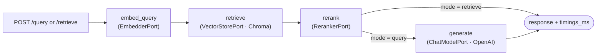
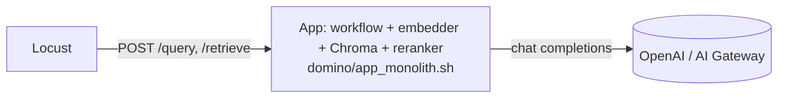
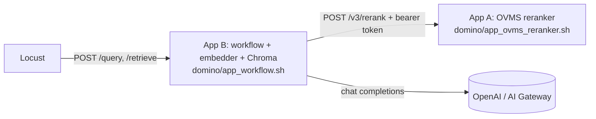
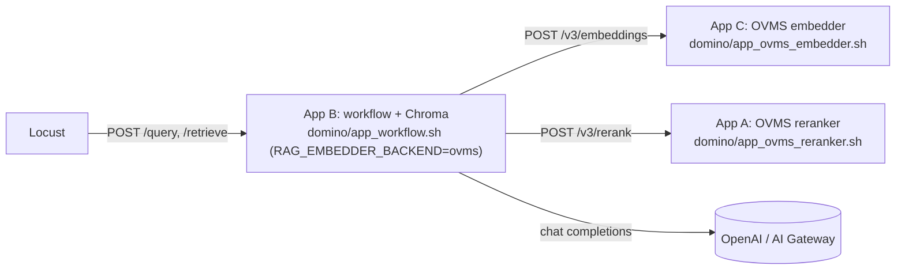

# rag_load_test — one RAG workflow, three Domino topologies, one Locust suite

A self-contained sub-project that load tests **the same text RAG workflow**
(sentence-transformers embedder → Chroma → cross-encoder reranker → OpenAI,
orchestrated by LangGraph, served by FastAPI) under three deployment
topologies on Domino Data Lab 6.2 and compares them:

| Topology | Domino apps | What runs where |
| --- | --- | --- |
| `monolith` | 1 | embedder + Chroma + reranker + workflow + OpenAI client in one process |
| `split-reranker` | 2 | **A** OpenVINO Model Server (OVMS) serving the reranker; **B** workflow + embedder + Chroma |
| `split-all` | 3 | **A** OVMS reranker; **C** OVMS embedder; **B** workflow + Chroma calling A and C over HTTP |

The workflow code is identical everywhere; only the transport behind the
`EmbedderPort` and `RerankerPort` changes (in-process model vs. HTTP call to
OVMS), selected by environment variables. That keeps the comparison
apples-to-apples. The package does not import `needle` / `needle_core`.

## Architecture

### Workflow (LangGraph)



Each node is timed; the response carries `timings_ms{embed,retrieve,rerank,generate,total}`
and Locust turns those into per-stage statistics.

### Topology `monolith`



### Topology `split-reranker`



### Topology `split-all`



### Code layout (hexagonal)

```text
src/rag_load_test/
  contracts/   ports.py (EmbedderPort, RerankerPort, VectorStorePort, ChatModelPort), models.py
  adapters/    local_* (sentence-transformers), ovms_* (httpx), chroma_store, openai_chat, fake_chat, auth, http_retry
  workflow/    LangGraph StateGraph built only from ports (state, prompts, nodes, graph, dependencies)
  api/         FastAPI app: /query /retrieve /healthz /readyz, tracing, JSON logs
  ingest/      synthetic corpus + JSONL loader + rag-ingest CLI
  loadtest/    locust-free helpers (stage events, auth headers, question bank, step shape)
  testing/     FakeEmbedder / FakeReranker / InMemoryVectorStore
loadtest/locustfile.py       RagUser (FastHttpUser)
scripts/                     run_loadtest.sh, compare_runs.py
ovms/                        versions.env, export_models.sh, docker-compose.yml   (see ovms/README.md)
domino/                      app_*.sh entry points, environment/Dockerfile.*       (see domino/README.md)
```

## Quickstart (monolith on a laptop)

```bash
cd rag_load_test
make install-dev              # pip install -e ".[dev]"
cp .env.example .env          # set OPENAI_API_KEY, or RAG_LLM_BACKEND=fake to skip the LLM
make ingest                   # rag-ingest --synthetic 200 -> ./data/chroma (downloads BAAI/bge-small-en-v1.5 once)
make serve                    # rag-serve on http://0.0.0.0:8888
```

```bash
curl -X POST localhost:8888/query -H 'Content-Type: application/json' \
  -d '{"question":"How many vacation days do employees get at Northwind Analytics?"}'

curl -X POST localhost:8888/retrieve -H 'Content-Type: application/json' \
  -d '{"question":"How are expenses reimbursed?","top_k":10,"rerank_top_k":3}'

curl localhost:8888/readyz
```

`make ingest` embeds with the configured `RAG_EMBEDDER_BACKEND`; the collection
records the embedder name and `/readyz` reports a mismatch with the serving
embedder. A real corpus can be loaded with
`rag-ingest --corpus docs.jsonl` (one `{"id","title","text","metadata"}` object per line).

Without an OpenAI key: `RAG_LLM_BACKEND=fake make serve`
(`RAG_FAKE_LLM_LATENCY_MS=300` imitates generation time so `/query` still
exercises the full graph).

## Split topologies on a laptop (docker)

```bash
make ovms-export && make ovms-up      # export int8 models to ovms/models, start reranker :8001 + embedder :8002

# split-reranker
RAG_TOPOLOGY=split-reranker RAG_RERANKER_BACKEND=ovms RAG_OVMS_RERANK_URL=http://localhost:8001 make serve

# split-all
RAG_TOPOLOGY=split-all RAG_RERANKER_BACKEND=ovms RAG_OVMS_RERANK_URL=http://localhost:8001 \
  RAG_EMBEDDER_BACKEND=ovms RAG_OVMS_EMBEDDINGS_URL=http://localhost:8002 make serve

make ovms-down
```

Details, request shapes and the version pin live in [`ovms/README.md`](ovms/README.md).
Deployment on Domino (apps, environments, datasets, auth) is in
[`domino/README.md`](domino/README.md).

## Load test

One headless Locust run per topology, then a comparison table:

```bash
make loadtest RUN_NAME=monolith HOST=http://localhost:8888
make loadtest RUN_NAME=split-reranker HOST=http://localhost:8888
make loadtest RUN_NAME=split-all HOST=http://localhost:8888
make compare                          # results/comparison.md
```

`make loadtest` runs `scripts/run_loadtest.sh <RUN_NAME> <HOST> <USERS> <SPAWN_RATE> <RUN_TIME>`
(defaults `USERS=20 SPAWN_RATE=5 RUN_TIME=2m`) and writes
`results/<RUN_NAME>_stats.csv`, `_failures.csv` and `.html`. `HOST` is the
service base URL (on Domino: the App URL, no trailing slash).

| Knob | Effect |
| --- | --- |
| `USERS`, `SPAWN_RATE`, `RUN_TIME` | Makefile variables passed to `locust -u -r -t` |
| `RAG_LOADTEST_QUERY_WEIGHT` / `RAG_LOADTEST_RETRIEVE_WEIGHT` | task weights, default `1` / `3` |
| `RAG_LOADTEST_SHAPE=step` | step load 5 → 10 → 20 → 40 users, 60 s each (set `RUN_TIME=4m` or more) |
| `RAG_LOADTEST_BEARER_TOKEN` | sent as `Authorization: Bearer ...` (Domino run token) |
| `DOMINO_API_KEY` | sent as `X-Domino-Api-Key` (from outside Domino) |

Every successful response's `timings_ms` is re-emitted as Locust `STAGE` rows
(`/query:embed`, `/query:retrieve`, `/query:rerank`, `/query:generate`, same for
`/retrieve`), so p50/p95/p99 per stage land in the same CSV as the endpoint
totals. `make compare` feeds every `results/*_stats.csv` (sorted, so
`monolith` is the baseline) to `scripts/compare_runs.py`, which prints one
markdown table per endpoint and per stage: requests, failure %, RPS, p50, p95,
p99 and Δp95 versus the first run. Pick another baseline by calling the script
directly: `python scripts/compare_runs.py results/split-all results/monolith --out results/comparison.md`.

## HTTP API

| Route | Body → result |
| --- | --- |
| `POST /query` | `{question, top_k?, rerank_top_k?}` → `{request_id, deployment, mode, answer, passages[], timings_ms{embed,retrieve,rerank,generate,total}}` |
| `POST /retrieve` | same request → same response without `answer` (`generate` skipped, `generate_ms = 0`) |
| `GET /healthz` | `{"status":"ok"}` |
| `GET /readyz` | `{"status":"ready"\|"not_ready","checks":[{name,ok,detail}]}`; `503` when a check fails |

Headers `X-RAG-Topology` and `X-Request-ID` are set on every response (an
incoming `X-Request-ID` is propagated). Errors: dependency failure → `503`
`{"error":"<component>_unavailable"}`, upstream timeout → `504`
`{"error":"<component>_timeout"}`, validation → `422`. `root_path` follows
`DOMINO_RUN_HOST_PATH` so the docs work behind Domino's proxy.

## Configuration (`RAG_*` environment variables or `.env`)

| Variable | Default | Meaning |
| --- | --- | --- |
| `RAG_TOPOLOGY` | `monolith` | Free-form label echoed in responses (`deployment`) and the `X-RAG-Topology` header |
| `RAG_EMBEDDER_BACKEND` | `local` | `local` \| `ovms` \| `fake` |
| `RAG_EMBEDDER_MODEL` | `BAAI/bge-small-en-v1.5` | HF id for `local` |
| `RAG_RERANKER_BACKEND` | `local` | `local` \| `ovms` \| `fake` \| `none` (`none` passes the top candidates through, `rerank_ms ≈ 0`) |
| `RAG_RERANKER_MODEL` | `BAAI/bge-reranker-base` | HF id for `local` |
| `RAG_OVMS_EMBEDDINGS_URL` | `http://localhost:8002` | base URL; the adapter appends `/v3/embeddings` |
| `RAG_OVMS_EMBEDDINGS_MODEL` | `bge-small-en-v1.5` | servable name in the OVMS config |
| `RAG_OVMS_RERANK_URL` | `http://localhost:8001` | base URL; the adapter appends `/v3/rerank` |
| `RAG_OVMS_RERANK_MODEL` | `bge-reranker-base` | servable name in the OVMS config |
| `RAG_OVMS_AUTH` | `none` | `none` \| `static` \| `domino` (bearer fetched from `RAG_DOMINO_ACCESS_TOKEN_URL`) |
| `RAG_OVMS_BEARER_TOKEN` | `` | token used when `RAG_OVMS_AUTH=static` |
| `RAG_DOMINO_ACCESS_TOKEN_URL` | `http://localhost:8899/access-token` | Domino run token endpoint |
| `RAG_HTTP_TIMEOUT_S` | `30` | per-request timeout for OVMS calls |
| `RAG_HTTP_MAX_RETRIES` | `2` | bounded retries (backoff 0.2 s, 0.4 s) on connection errors / 5xx |
| `RAG_LLM_BACKEND` | `openai` | `openai` \| `fake` |
| `RAG_OPENAI_MODEL` | `gpt-4o-mini` | plus the standard `OPENAI_API_KEY`, `OPENAI_BASE_URL` (Domino AI Gateway) |
| `RAG_OPENAI_TIMEOUT_S` | `60` | |
| `RAG_OPENAI_MAX_RETRIES` | `2` | |
| `RAG_FAKE_LLM_LATENCY_MS` | `0` | simulated generation latency for `fake` |
| `RAG_CHROMA_PATH` | `./data/chroma` | `:memory:` selects Chroma's `EphemeralClient` |
| `RAG_CHROMA_COLLECTION` | `rag_passages` | |
| `RAG_TOP_K_RETRIEVE` | `20` | candidates fetched from Chroma |
| `RAG_TOP_K_RERANK` | `5` | passages kept after rerank and sent to the LLM |
| `RAG_MODEL_THREADS` | `4` | thread-pool size for local models and Chroma |
| `RAG_DOMINO_TRACING` | `false` | wrap `/query` with Domino `add_tracing` |
| `RAG_HOST` / `RAG_PORT` | `0.0.0.0` / `8888` | Domino apps must keep these |
| `RAG_LOG_LEVEL` | `info` | JSON logs |

Invalid values fail fast at start-up with the offending value and the accepted
set, e.g. `RAG_RERANKER_BACKEND: got 'ovsm', expected one of local, ovms, fake, none`.

## Robustness defaults

Every network call has a timeout and bounded retries (`RAG_HTTP_MAX_RETRIES`,
`RAG_OPENAI_MAX_RETRIES`, both `2`); adapter failures surface as
`RagDependencyError(component, detail, target)` → `503`/`504`. Local models
load in the FastAPI lifespan so a broken model fails at start-up, not on the
first request; CPU work runs in a bounded thread pool (`RAG_MODEL_THREADS`) so
overload degrades into queueing. No circuit breakers or rate limiting.

## Development

```bash
make test          # pytest: no model weights, no network (fakes, httpx.MockTransport, Chroma EphemeralClient)
make lint          # ruff check + black --check over src tests loadtest scripts
make format        # ruff --fix + black
make typecheck     # mypy src
```

`tests/conftest.py` sets `LOCUST_SKIP_MONKEY_PATCH=1` before any `import locust`
so the asyncio-based service tests are never gevent-patched.
